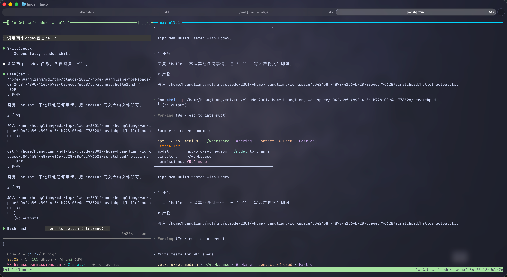

# call-in-tmux

> One self-contained doorway for agent-to-agent calls over tmux. Say「调用 cursor / 让 kimi / 派给 codex」— no separate `cx-*` / `cc-*` skills required.

Inspired by [huanglune/cc-codex-tmux](https://github.com/huanglune/cc-codex-tmux): split a tmux pane, send another CLI agent the brief, and return with a written report. This repo keeps that workflow and extends it into a host × engine matrix (Claude / Codex / Kimi calling Codex / Cursor / Kimi).



<p align="center"><sub>Screenshot from <a href="https://github.com/huanglune/cc-codex-tmux">huanglune/cc-codex-tmux</a> — Codex panes beside Claude Code. Same tmux-dispatch idea; we reuse it across more hosts and engines.</sub></p>

Engine scripts are **vendored** under `engines/`. This repo runs on its own after `install.sh`.

## Supported edges

```text
claude ──► codex | cursor | kimi
codex  ──► cursor | kimi
kimi   ──► cursor
```

Source of truth: `config/matrix.json`. Details: [docs/MATRIX.md](docs/MATRIX.md).

## Install

```bash
cd /path/to/call-in-tmux
bash install.sh --all-hosts
call-in-tmux matrix
```

This installs:

1. `~/.local/bin/call-in-tmux`
2. Host skill `call` for Claude / Codex / Kimi (Claude: `${CLAUDE_CONFIG_DIR:-~/.claude}/skills/call`)
3. Engine hooks from **this repo**, only for engines the chosen hosts can reach (`engines/cursor`, `engines/kimi/cx`)

Under cac (one `CLAUDE_CONFIG_DIR` per env), run `bash install.sh --host claude --skills-only` once inside each env.

Do **not** install Codex plugins `cx-kimi-tmux` / `cx-cursor-tmux` as separate skills — use `$call` only.

## Usage

```bash
CALL_IN_TMUX_HOST=codex call-in-tmux to cursor \
  -t review -C /abs/project -o /abs/out.report.md --brief /abs/out.brief.md --timeout 900

# Claude: run in background, no --timeout; engine-native flags go after --
CALL_IN_TMUX_HOST=claude call-in-tmux to codex \
  -t review -C /abs/project -o /abs/out.report.md --brief /abs/out.brief.md \
  -- -c 'model_reasoning_effort="max"'

call-in-tmux matrix
call-in-tmux resolve kimi --from codex
```

In a new host session:

```text
调用 cursor 审查……
让 kimi 补测试
派给 codex 做并发审查
```

## Layout

```text
bin/call-in-tmux          router CLI
config/matrix.json        edges + runners (all under engines/)
engines/codex/            vendored codex-tmux
engines/cursor/           vendored cursor-tmux + hooks installer
engines/kimi/cx/          vendored cx-kimi dispatcher + hooks (all hosts → kimi)
engines/kimi/cc/          legacy cc-kimi dispatcher; not routed, not installed
hosts/{claude,codex,kimi} thin skills (wake semantics only)
```

## Tests

```bash
python3 -m unittest discover -s tests -v
bash -n bin/call-in-tmux lib/common.sh
```

## License

MIT — see [LICENSE](LICENSE). Vendored engine copyrights remain with their original authors; see [UPSTREAM.md](UPSTREAM.md).
